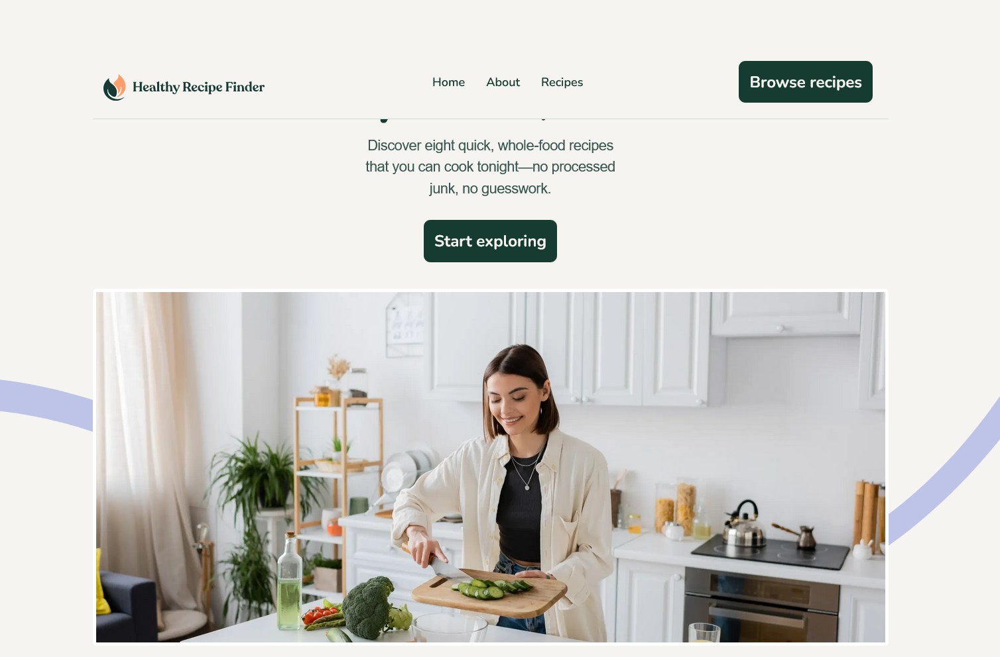

# Frontend Mentor - Recipe finder website solution

This is a solution to the [Recipe finder website challenge on Frontend Mentor](https://www.frontendmentor.io/challenges/recipe-finder-website--Ui-TZTPxN). Frontend Mentor challenges help you improve your coding skills by building realistic projects.

## Overview

### The challenge

Users should be able to:

- View the home, about, recipes index, and recipe detail pages
- Search for recipes by name or ingredient
- Filter recipes by max prep or cook time
- View the optimal layout for the interface depending on their device's screen size
- See hover and focus states for all interactive elements on the page

### Screenshot

### Links

- Solution URL: https://github.com/cgojk/HealthyMeals
- Live Site URL: https://comforting-conkies-5f4bc6.netlify.app/

## My process

### Built with

- Semantic HTML5 markup
- CSS custom properties
- Flexbox
- CSS Grid
- Mobile-first workflow
- React

### What I learned

This project took me a considerable amount of time to complete, but it was a valuable learning experience. Every day, new challenges came up, and I learned something new. One of the main things I learned was how to use React Router components and the use of resuability; in this case the button recipes, I reused the bases of the button to create the submenu and other different buttons that were taking part in this project.

Throughout the project, I encountered several issues related to image paths, image positioning, deployment, and integrating components into the main pages, differet css styles, Although I was able to solve these problems other still not, I realised that I often write more code than necessary and need to focus on optimizing my solutions. I tend to overthink problems, which sometimes leads me to create overly complex implementations with unnecessary code.

In many situations, I had to delete code and rebuild parts of the markup. For example, on the recipe details page, I initially used variants to change styles based on different conditions. However, this approach became confusing and difficult to maintain, so I decided to redesign the markup however the reuslt was better than before so still a lot of work to do..

One of the most important lessons I learned for future projects is to spend more time planning the base structure and markup before starting development. This can help avoid stupid issues and reduce the need for major changes later. I also learned that I should avoid relying on excessive CSS to force design changes, as this can unnecessarily complicate the codebase. Keeping components, navigation, and styling simple and well-structured will make future projects more maneable. anyway still al ot to learn i want to leanr more about reusability, router, more about react etc..

### Useful resources

- W3 Schools, Scrimba, Documentation React

## Author

Catalina G.
